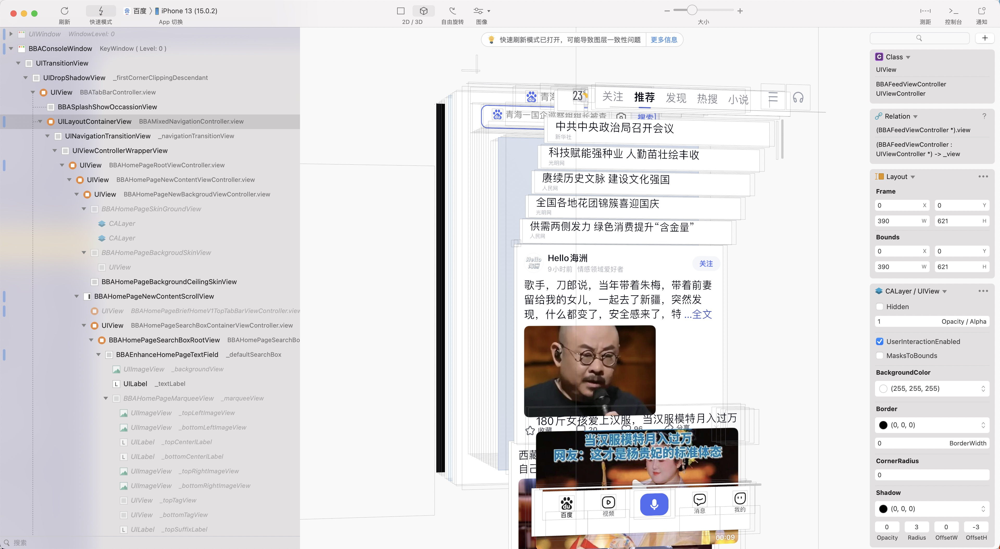
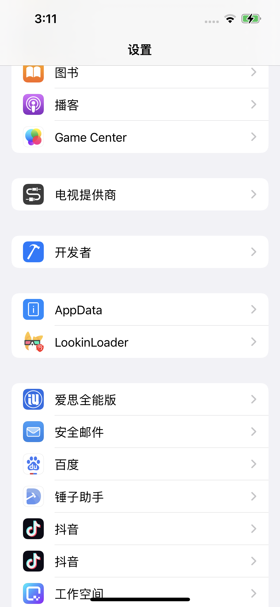
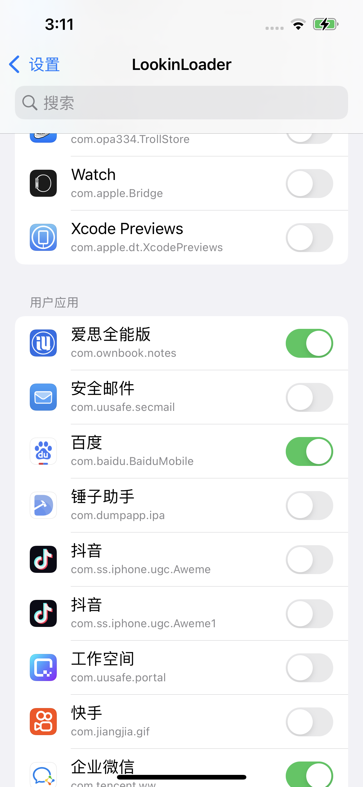

# LookinRootless


<div style="display: flex;">
    
		
</div>


### Looin版本

- iOS 1.2.8
- macOS 1.0.7

### Rootless 版本

安装 `packages`目录下的`deb`文件

### 手动编译

- 安装`theos`开发环境
- 安装`AltList`环境[opa334/AltList: A modern AppList alternative (github.com)](https://github.com/opa334/AltList)
- 下载源码`git clone https://github.com/DargonLee/LookinRootless`
- 修改路径

```obj
rootless环境
- 修改Tweak.x文件中的
NSString* prefix = @"/var/containers/Bundle/Application/.jbroot-038CCAEDDB43FECE";
为
NSString* prefix = @"/var/jb";

roothide环境
- 修改Tweak.x文件中的
NSString* prefix = @"/var/containers/Bundle/Application/.jbroot-038CCAEDDB43FECE";
替换随机字符串038CCAEDDB43FECE
- /var/containers/Bundle/Application/.jbroot-xxxxxxx
把038CCAEDDB43FECE替换为xxxxxxx
```

- 编译

```shell
cd LookinRootless
make do
```

- 安装

去 `packages` 中安装 `deb` 包


### 更新 Lookin

- `git clone https://github.com/QMUI/LookinServer`
- 增加 `arm64e`架构
- 编译出`Lookin.framework`
- 把编译的 framework 替换到`layout/Application Support/LookinLoader`中
- 重新编译

